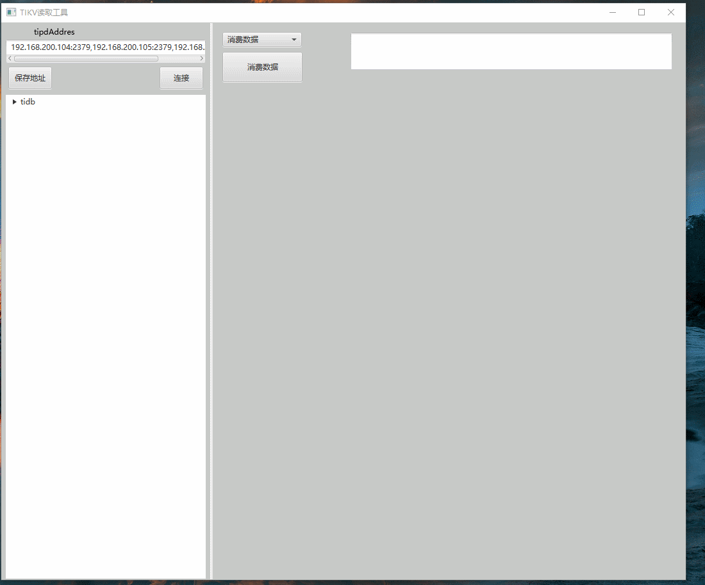

# tikvReader

#### Description
Tikv reader, read Tikv like reading Kafka/Redis.
The software of this program is developed through TIDB's tikvClient. TIDB storage architecture is in KV format, and when TIDB stores data, there will be an implicit row_id, which is the Key value of KV storage. You can read data by using this characteristic and the row_id.

#### Software Architecture
A Tikv GUI written using JavaFX.

#### Installation

1.  The EXE file in the application directory is the installed version, the RAR file is the no-installation version, and the JAR package can be started by yourself.
3.  xxxx

#### Instructions

1.  Fill in the tipd address, you can choose to save, click connect and you can connect to the tables in Tikv.
2.  Choose the corresponding table, choose consume data to consume data with a specified amount, and now consume data according to the key is to consume a single data with a specified key, similar to Redis.
3.  Click on the consumed data to display the JSON formatted data.

#### Contribution

1.  Fork the repository
2.  Create Feat_xxx branch
3.  Commit your code
4.  Create Pull Request

