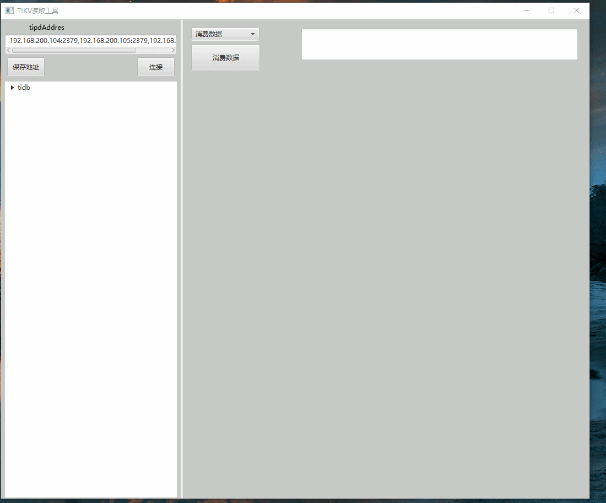

# tikvReader

#### 介绍
tikv读取器，像读取Kafka/Redis 一样读取tikv。

本程序的软件是通过TIDB 的tikvClient 进行开发。TIDB 存储架构 即是KV 格式，TIDB 存储数据 会有一个隐式row_id ，这个row_id 就是KV 存储的Key 值。 利用这个特性可以通过row_id 来读取数据。

#### 软件架构
使用javaFX 写的Tikv GUI 。

#### 安装教程

1.  application 目录下exe 文件为安装版，rar 为 免安装版，jar 包启动可以自己打。

#### 使用说明

1.  填写tipd 地址，可选择保存，点击连接及可连接tikv里的表。
2.  选择对应的表，选择消费数据 即是消费指定数据量的数据，现在按照key消费 即是指定key 消费单条数据，类似redis。
3.  点击消费的数据，即可展示JSON 格式化后的数据。

#### 参与贡献

1.  Fork 本仓库
2.  新建 Feat_xxx 分支
3.  提交代码
4.  新建 Pull Request

#### 特技

1.  个人公众号 与本账号名称一致,需要可以联系；

### 后续计划：

1. 增加put 数据功能
2. 增加 指定 row_id 开始位置，这个类似kafka 指定offset 消费数据，目前默认从0 开始
3. 优化界面

